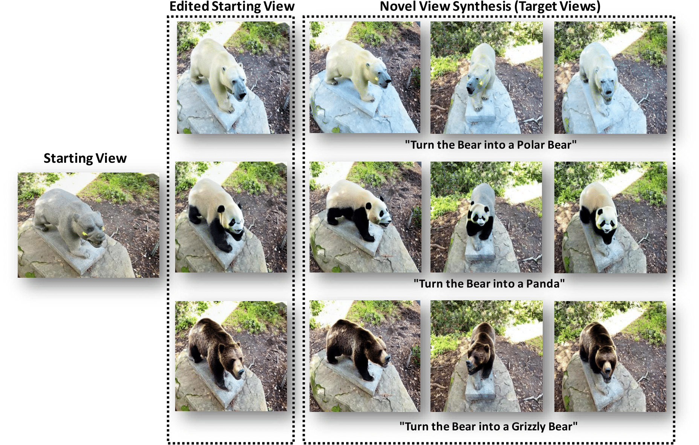
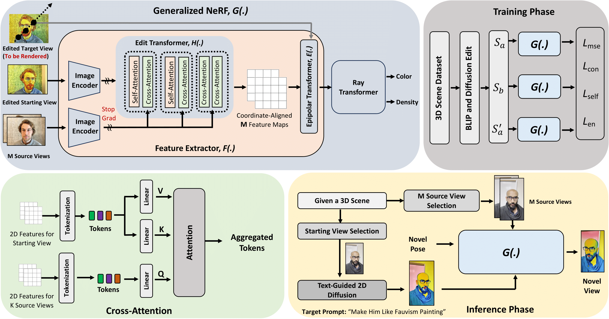
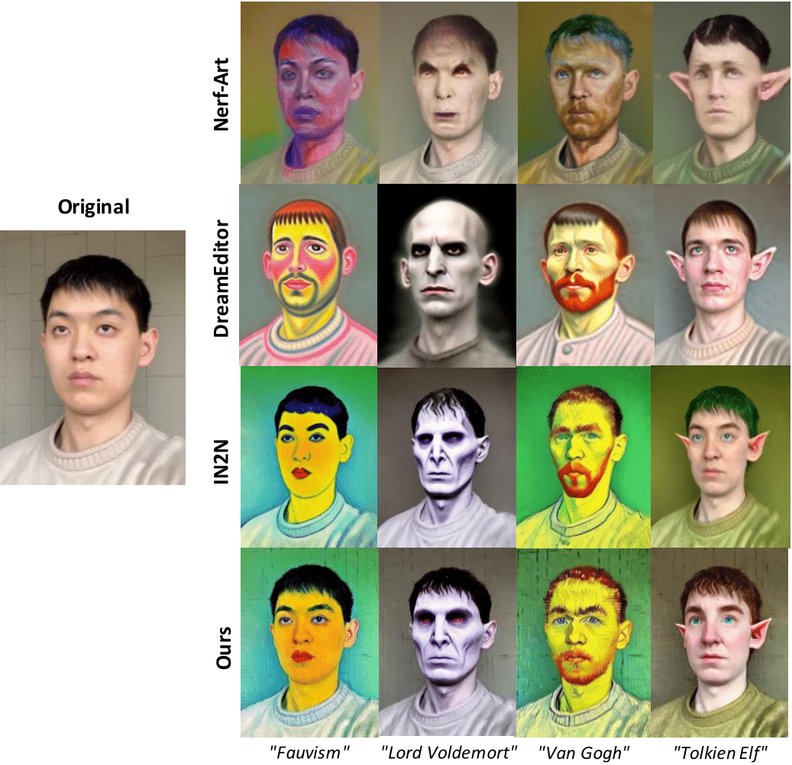
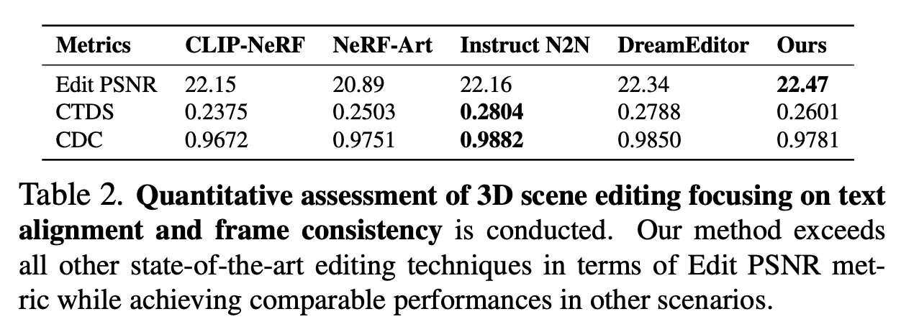

# Under Construction!! the code will be available soon!

<h2 align="center"> <a href="https://github.com/nazmul-karim170/FreeEditor-Text-to-3D-Scene-Editing">Free-Editor: Zero-shot Text-driven 3D Scene Editing</a></h2>
<h5 align="center"> If you like our project, please give us a star ⭐ on GitHub for the latest update.  </h2>

<h5 align="center">

[](https://free-editor.github.io/)
[](https://arxiv.org/abs/2312.13663)
[](https://github.com/nazmul-karim170/FreeEditor-Text-to-3D-Scene-Editing/blob/main/LICENSE) 


</h5>

## [Project page](https://free-editor.github.io/) | [Paper](https://arxiv.org/abs/2312.13663) 




## 😮 Highlights

Free-Editor allows you to edit your 3D scenes by **editing only a single view** of that scene. The editing is **training-free** and can be done in a matter of **3 minutes!** instead of **70 minutes!** in SOTA. 


### 💡 Training-free, View Consistent, High-quality, and Fast-speed
- Stable Diffusion (SD) for image generation   -->   high-quality
- Single View editing  --> higher chance of view-consistent editing as it is hard to obtain consistent editing effects in multiple views with SD
- The editing process is training-free as we use a generalized NeRF model -->   fast high-quality 3D content reconstruction.


## 🚩 **Updates**

Welcome to **watch** 👀 this repository for the latest updates.

✅ **[2023.12.21]** : We have released our paper, Free-Editor on [arXiv](https://arxiv.org/abs/2312.13663).

✅ **[2023.12.18]** : Release [project page](https://free-editor.github.io/).
- [ ] Code release.

## 🛠️ Methodology


Overview of our proposed method. We train a generalized NeRF (G(.)) that takes a single edited starting view and M source views to render a novel target view. Here, ”Edited Target View” is not the input to the model rather will be rendered and works as the ground truth for the prediction of G(.). In G(.) we employ a special Edit Transformer that utilizes: cross-attention to produce style-informed source feature maps that will be aggregated through an Epipolar Transformer. At inference, we can synthesize novel edited views in a zero-shot manner. To edit a scene, we take only a single image as the starting view and edit it using a Text-to-Image (T2I) diffusion model. Based on this starting view, we can render novel edited target views.


## Implementation

### Create environment  

Do the Following-

    ```bash
        conda create --name nerfstudio -y python=3.9
        conda activate nerfstudio
        python -m pip install --upgrade pip
    ```

### Install dependencies

    * If you have exisiting installation, first make sure to uninstall using this command:

    ```bash
        pip uninstall torch torchvision functorch tinycudann
    ```

    * Then Install CUDA 11.8 with this command:

    ```bash
        conda install -c "nvidia/label/cuda-11.8.0" cuda-toolkit
    ```

    * Then install Pytorch 2.1.2 using this command:

    ```bash
        pip install torch==2.1.2+cu118 torchvision==0.16.2+cu118 --extra-index-url https://download.pytorch.org/whl/cu118
    ```

    * After pytorch and ninja, install the torch bindings for tiny-cuda-nn:

    ```bash
        pip install ninja git+https://github.com/NVlabs/tiny-cuda-nn/#subdirectory=bindings/torch
    ```

    * Installing NerfStudio: Sometimes, you may face issue with configobj or other packages, manually install them from source. For example,

    ```bash
        git clone https://github.com/DiffSK/configobj.git
        cd configobj
        python setup.py install
    ```

    * From pip (it does not work in cluster):

    ```bash
        pip install nerfstudio
    ```

    * If you want build from source and want the latest development version, use this command:

    ```bash
        git clone https://github.com/nerfstudio-project/nerfstudio.git
        cd nerfstudio
        pip install --upgrade pip setuptools
        pip install -e .
    ```

    * Download some test data: 

    ```bash
        ns-download-data nerfstudio --capture-name=poster           
    ```

    * Train model

    ```bash
        ns-train nerfacto --data data/nerfstudio/poster
    ```

    If you start seeing on your linux terminal that it started training, then it means everything is good to go!

There maybe additional dependencies you have to install as well.

### Dataset and Pre-trained Models Download 
 
To download other datasets, please visit this link - https://huggingface.co/datasets/yangtaointernship/RealEstate10K-subset/tree/main

      * Here, "synthetic_scenes.zip" is the deepvoxels data.

      * "nerf_synthetic" and blender dataset possibly the same dataset.

      * "frames.zip" is the extracted frames for 200 scenes of RealEstate10K dataset. "train.zip" is the camera files. 

      * For Shiny Dataset, go to - https://nex-mpi.github.io/

      * For Spaces Dataset, 

      ```bash
            git clone https://github.com/augmentedperception/spaces_dataset
      ```

      * If you want to use "nerfbaselines", 

        ```bash
            conda deactivate 
            conda create --name nerfbase 
            conda activate nerfbase
            pip install nerfbaselines
        ```

      * Download Sample Datasets. For Example,

            * Downloads the garden scene to the cache folder.

                  ```bash
                  mdkir data
                  cd data
                  mkdir nerf_dataset
                  cd nerf_dataset
                  
                  nerfbaselines download-dataset external://mipnerf360/garden
                  ```

            * Downloads all nerfstudio scenes to the cache

                  ```bash
                  nerfbaselines download-dataset external://nerfstudio
                  ```

            * Downloads kithen scene to folder kitchen

                  ```bash
                  nerfbaselines download-dataset external://mipnerf360/kitchen -o kitchen
                  ```

    * Caption Generation Model 

        ```bash
            git clone https://huggingface.co/Salesforce/blip2-opt-2.7b
        ```     

    * Stable Diffusion 3 Medium (Fast and Accurate)

        ```bash
            git clone https://huggingface.co/stabilityai/stable-diffusion-3-medium
        ```        

    * If you don't want to download the pre-trained model, generate an access token in hugging face (Go to your account settings) and login into your account 

        ```bash
            huggingface-cli login
        ``` 
### Free-Editor Dataset Generation

      ```bash
            python src/fedit/dataset_creation.py 
      ```


## 🚀 3D-Editing Results

### Qualitative comparison



### Quantitative comparison


Quantitative evaluation of scene edits in terms of Edit PSNR, CLIP Text-Image Directional Similarity (CTDS) and CLIP directional consistency (CDS).

## 👍 **Acknowledgement**
This work is built on many amazing research works and open-source projects, thanks a lot to all the authors for sharing!
* [InstructPix2Pix](https://github.com/timothybrooks/instruct-pix2pix)
* [Instruct-NeRF2NeRF](https://github.com/ayaanzhaque/instruct-nerf2nerf)
* [Diffusers](https://github.com/huggingface/diffusers)

## ✏️ Citation
If you find our paper and code useful in your research, please consider giving a star :star: and a citation :pencil:.

```BibTeX
@misc{karim2023freeeditor,
      title={Free-Editor: Zero-shot Text-driven 3D Scene Editing}, 
      author={Nazmul Karim and Umar Khalid and Hasan Iqbal and Jing Hua and Chen Chen},
      year={2023},
      eprint={2312.13663},
      archivePrefix={arXiv},
      primaryClass={cs.CV}
}
```
<!---->
